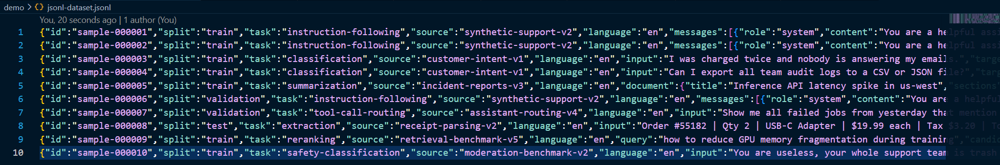
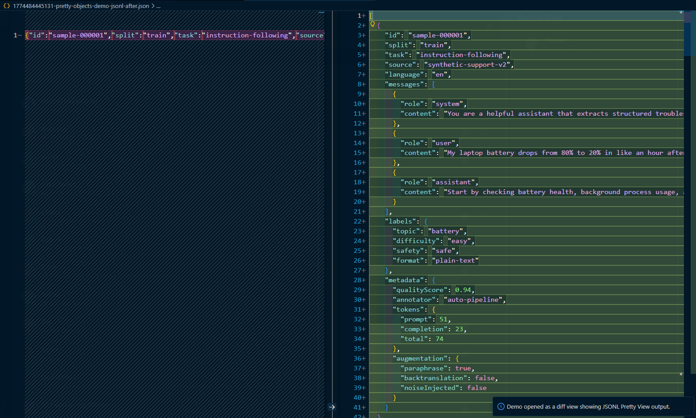
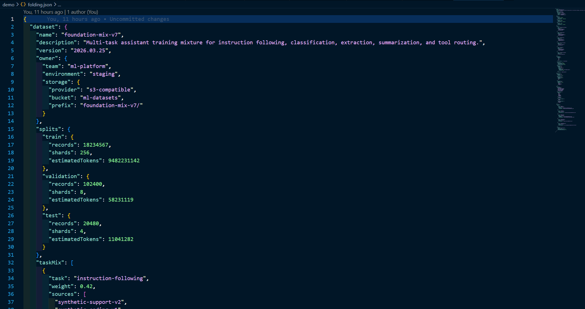
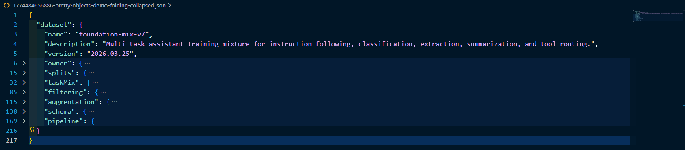
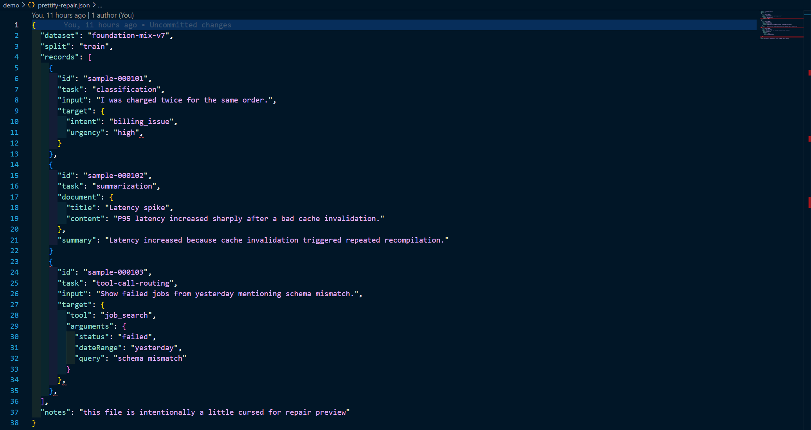
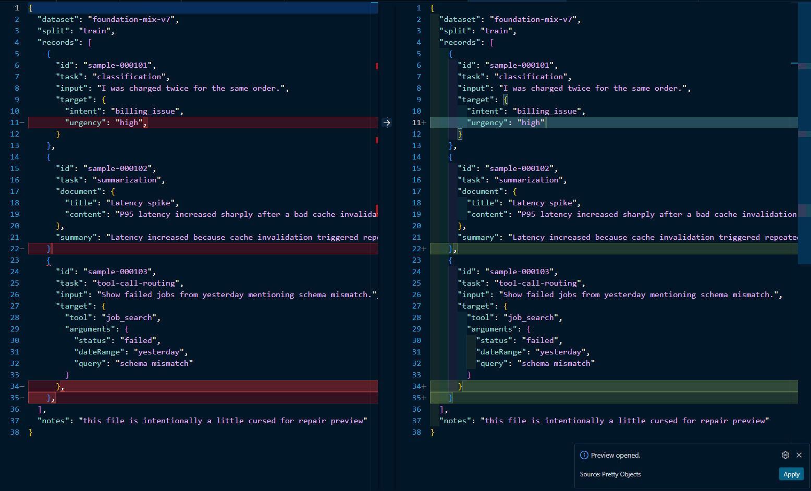
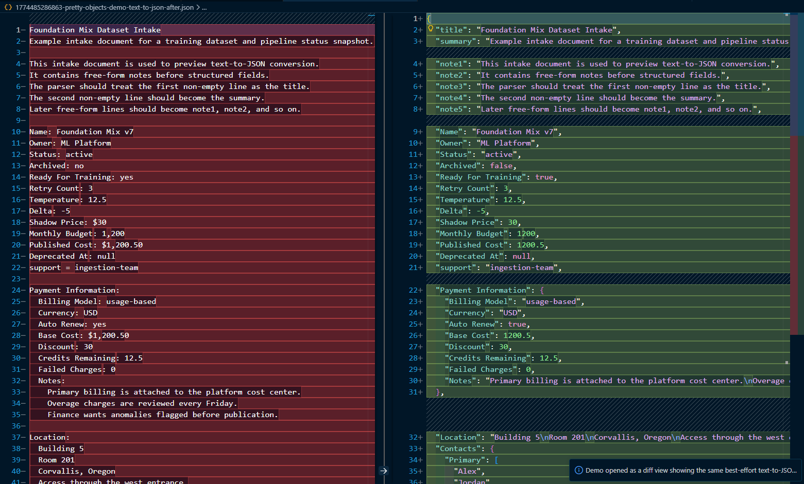

<!--
  File: README.md
  Project: pretty-objects
  Author: Anthony Kung <hi@anth.dev> (https://anth.dev)
  License: Apache-2.0
-->

# Pretty Objects

A tiny formatter and inspection tools for large structured object payloads. Pretty Objects is designed to make large or messy structured data human readable and easy to edit. It is developed by AI engineer to work on large AI datasets without going insane.

The Pretty Objects extension works with:

- JSON datasets
- JSONL / NDJSON training data
- structured logs
- large nested payloads
- partially malformed objects from real-world systems

The goal of this extension is simple:

**Make structured data easier to read, scan, and repair.**

But of course, it's designed the way that I like, so it may or may not be your cup of tea. Use at your own risk I suppose 😜 it's a side project so future development is limited but feel free to share your thoughts on GitHub and it might get implemented XD

Pretty Objects is designed on [Carrot Gay Theme](https://marketplace.visualstudio.com/items?itemName=Anthonykung.carrot-gay-theme), for best results you can use that theme or [Winter Is Coming](https://marketplace.visualstudio.com/items?itemName=johnpapa.winteriscoming) where CGT is based on.

> This extension does NOT transmit any data over the network. No telemetry, analytics, crash reports, usage tracking, data collection of any kind is ever collected. You should NEVER trust the words of some random extension, please verify the source code yourself as best practices.

# Why This Exists

I stares at large JSON/JSONL files all day when working on AI stuff, the VS code formatter leaves tons of newlines or squeeze all of them in one line or do whatever crazy stuff they do that looking at it is giving me headache. And I couldn't find something that work the way I wanted so my ADHD brain just made this when I'm supposed to do work 😅

But yeah TL;DR typical formatter just makes it valid but not human readable, Pretty Objects makes it human readable, tada end of story 🎉

This makes the following things much easier:

- inspecting dataset records
- scanning logs
- navigating nested payloads
- repairing slightly malformed objects

# Supported Formats

Pretty Objects supports formatting and inspection for:

- JSON
- JSONL / NDJSON
- JavaScript object and array literals
- TypeScript object and array literals
- Python literals (`dict`, `list`, `tuple`, `set`)

The formatter attempts to **preserve the original language style** rather than forcing everything into JSON. For JS / TS / Python files, Pretty Objects can either format a selected literal or conservatively rewrite supported embedded literals across a full source file.

Object literals currently only support TS/JS and Py, I have no idea what would happen if you try to run it on C++ or Verilog and it's 4 AM so I'm just gonna be like night night you're on your own with that one 😴 there may or may not be future expansion, leave a GitHub issue if you're interested.

# Demo

Use `Pretty Objects: Open Welcome` any time to launch interactive demos from the welcome screen. Open the Command Palette and run `Pretty Objects: Open Welcome` to bring it back later. Those demos open as before/after diff views for repair preview, JSONL pretty view, Object Viewer workflows, best-effort text-to-JSON conversion, TypeScript literal payload formatting, Python literal payload formatting, and folding. Demo documents are temporary in-memory tabs, so they do not create files on disk and are cleaned up automatically, simply do a `Developer: Reload Window` and they'll be handled for you.

## JSONL Dataset Review

Before formatting:



After converting to Pretty View:



Pretty View converts JSONL records into a readable structure so large datasets can be inspected more easily.

## Collapsing Nested Objects

Deep nested objects make large payloads difficult to scan.

Before:



After collapsing nested containers:



Pretty Objects uses **VS Code folding**, so the document itself remains valid.

## Repairing Slightly Broken Logs

Sometimes JSON contains data that is almost valid but not quite.

Before:



After repair:



Repairs are conservative and only applied when the parser can safely determine the intended structure.

# Features

## Prettify Objects

Format structured payloads while keeping them human readable.

Supported operations:

- Format Document
- Format Selection
- Preview changes before applying
- Full-document JS / TS / Python formatting that rewrites supported embedded literals in place
- Split oversized files into multiple part files using `prettyObjects.maxDocumentSize`

## JSONL Dataset Tools

Two modes are available when working with JSONL.

### Line Preserving

Each object remains on one line but is normalized.

This is useful when datasets must stay JSONL-compatible.

### Pretty View

Converts JSONL into a readable JSON structure for inspection.

Useful when reviewing datasets.

## Object Viewer

Review one array item or JSONL record at a time with a control panel using a temporary VS Code editor.

Supported workflows:

- Previous / next result navigation
- Edit the current object or value directly
- Insert before / after, append to end, duplicate detection, and empty-object warnings
- Diff the current item against another item in the same collection
- Search large collections without rendering every item
- Group records by a dotted field path and work inside filtered subsets
- Filter visible results to empty objects only or duplicate objects only
- Jump by absolute index, filtered result number, or page number
- Page through filtered result windows for very large collections
- Choose how many objects to show per page, with a default of 100
- Run bulk actions against filtered results, the current page, or an absolute range like 1 to 20
- Bulk delete objects, bulk delete empty objects, and bulk delete duplicate objects while keeping the first match in scope
- Edit the current item in a VS Code editor tab backed by in-memory viewer state
- Save the current item to a separate file only when explicitly requested
- Save from the temporary editor with `Ctrl+S` / `Cmd+S` and apply back to the source document without leaving the temporary editor
- Close stale temporary viewer tabs automatically after window reloads

The viewer currently targets **top-level arrays** and **JSONL / NDJSON documents**.

## Collapse Nested Objects

Large nested payloads can be collapsed for easier navigation.

Operations include:

- collapse nested containers
- expand nested containers

This uses **VS Code folding**, so the underlying data does not change.

## Safe Repair Mode

Malformed JSON is common in logs.

Pretty Objects includes bounded repair modes.

Repair modes:

**deterministic (default)**
Only predictable repairs are applied.

**moderate**
Allows additional limited repairs, including comment stripping and obvious missing-comma insertion in object and array positions.

**bestEffort**
Allows the temporary Object Viewer editor to fall back to best-effort text-to-structured conversion after standard repairs fail. This is opt-in and does not replace the normal JSON repair path in `deterministic` or `moderate`.

Current best-effort text-to-JSON support includes:

- `:` and `=` key/value separators
- repeated keys merged into arrays
- bullet lists converted into arrays
- indentation-aware nested blocks
- form-style section headers followed by nested key/value lines



If parsing fails entirely, the file is left unchanged.

## Restore Last Prettify

After formatting, the previous document snapshot is stored so the output can be restored in case you changed your mind or the result was not what you expected. Use `Pretty Objects: Restore Last Prettify` to restore the last prettify action, this is a one-level undo and does not support multiple undos.

# Commands

Frequently used commands:

```
Pretty Objects: Prettify Document
Pretty Objects: Open Object Viewer
Pretty Objects: Open Welcome
Pretty Objects: Prettify Selection
Pretty Objects: Prettify With Preview
Pretty Objects: Restore Last Prettify
Pretty Objects: Convert JSONL To Pretty View
Pretty Objects: Collapse Nested Objects
Pretty Objects: Expand Nested Objects
Pretty Objects: Split Large File By Max Document Size
```

Having too many commands are annoying I don't want to see a wall of commands and have to carefully look for what I want every time, so only the most frequently used commands are included in the main command surface. Most of the other stuff are in extension settings or the welcome page, but all you have to remember is use the `Pretty Objects: Open Welcome` and everything else is on that page.

> WARNING: `Pretty Objects: Dangerously Reset Extension State` is a destructive action that resets all extension state, including Object Viewer state and the last prettify snapshot. This is the nuclear button to act as a reinstall, you have been warned I can't help if your configuration gone missing.

# Keybindings

Default formatter shortcut:

```
Shift + Alt + F
```

Runs Pretty Objects when it is the default formatter.

Use VS Code formatter settings to make Pretty Objects the default formatter for JSON / JSONL. Use `Format Document With...` or set `[json]` / `[jsonc]` `editor.defaultFormatter` to this extension.

If Pretty Objects is not the default formatter, you can still use the following:

Dedicated `Pretty Objects: Prettify Document` shortcut:

```
Ctrl + Alt + Z
Cmd + Alt + Z (macOS)
```

Object Viewer `Pretty Objects: Open Object Viewer` shortcut:

```
Ctrl + Alt + Q
Cmd + Alt + Q (macOS)
```

This opens the Object Viewer directly when its keybinding is enabled.

# Settings

### `prettyObjects.repairMode`

Controls repair behavior.

```
deterministic
moderate
bestEffort
```

### `prettyObjects.previewBeforeApply`

Show preview diff before applying formatting.

### `prettyObjects.jsonlMode`

JSONL formatting mode.

```
linePreserving
prettyView
```

### `prettyObjects.quoteStyle.jsTs`

Preferred quote style for JavaScript and TypeScript.

### `prettyObjects.quoteStyle.python`

Preferred quote style for Python.

### `prettyObjects.maxDocumentSize`

Safety guard for extremely large files. If it gets too large, it's gonna become super slow and I don't wanna wait.

Of course, you're gonna be wondering well you're dealing with massive gigabytes training data all da time so how's this gonna work? Well, you can use the `Pretty Objects: Split Large File By Max Document Size` command to split a large file into multiple part files that are each below the size limit, and then work with those part files individually. And no there's no stich back together command, but I'm sure you can figure something out 😉

### `prettyObjects.collapseNestedFieldsByDefault`

Automatically collapse nested containers after formatting.

### `prettyObjects.enableKeybinding`

Enable or disable Pretty Objects keybindings.

### `prettyObjects.enableObjectViewerKeybinding`

Enable or disable the Pretty Objects Object Viewer keybinding.

# Important Notes

JS / TS and Python support can work on **real source files**, but the formatter is still intentionally conservative: it rewrites supported embedded object / array / dict / list style literals in place so you would still need your regular code formatter.

VS Code currently does not support running multiple formatters in sequence. If you want `Format Document` to run Pretty Objects, set it as the default formatter for JSON/JSONL.

Object Viewer temporary editors are **virtual in-memory documents**, not normal files. Saving them updates the source collection, formats the current item first, and keeps focus on the temporary editor. To close stale temporary editors, simply do a `Developer: Reload Window` and poof they'll be gone.

# About the Author

Ello! I'm Anthony Kung, a PhD student at Oregon State University working on AI hardware acceleration. I built Pretty Objects because all the massive AI training datasets and structured logs are such a pain to read and there's nothing that makes it the way I wanted so I made it myself :P

Pretty Objects started as a tool to make my own dataset workflow less painful. If it makes your object payloads easier to read too, then yay :3

Oh and if you haven't noticed, I'm a little crazy 🤪 this extension is created to indulge in my craziness, it may not always be the most sensible choice for everyone.

I've yapped too much already, if you want to see more of my shenanigans or get in touch, here's where you can find me:

- Website: https://anth.dev

# License

Apache License 2.0

# Policies

Terms of Service
https://anth.dev/terms

Privacy Policy
https://anth.dev/privacy

<p align="center">

Created with 💖 by <a href="https://anth.dev">Anthony Kung</a>

</p>
